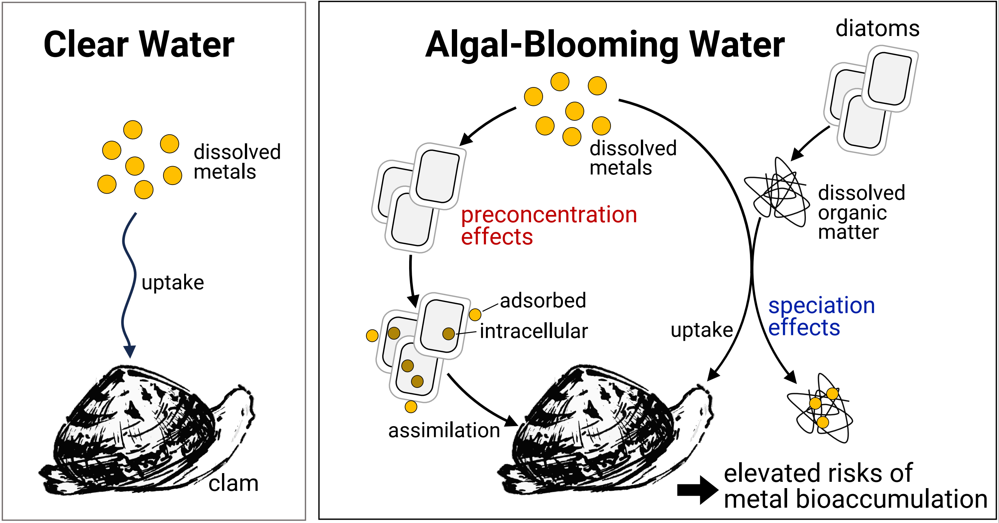
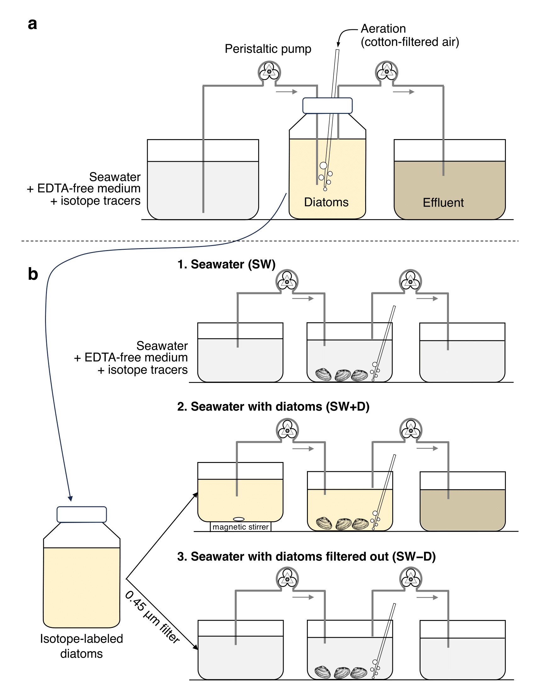
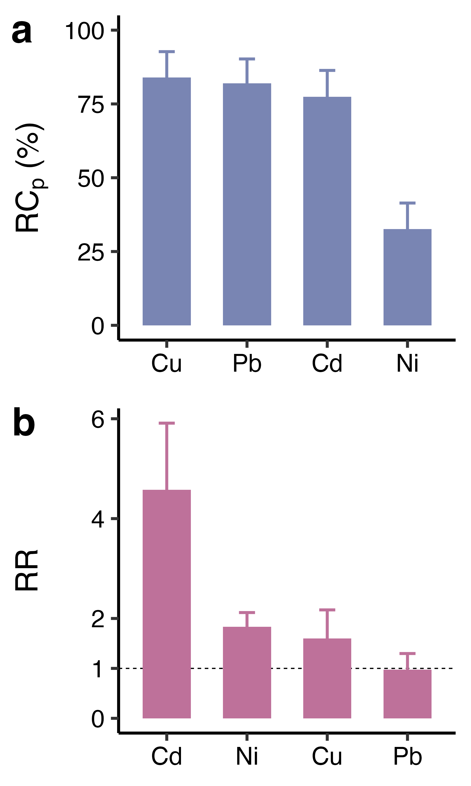

<a href="HeWY_2025_MPB.pdf" target="_blank">Download PDF</a>


```{r title-output, results='asis', echo=FALSE}
if (knitr::is_html_output()) {
  cat('
<div style="text-align: center; margin-top: 20px;">
  <h1><strong>Simulating the Multiple Effects of a Diatom Bloom on Metal Bioaccumulation in Clams</strong></h1>
  <p><strong>
    Weiyi He<sup>1</sup>, Fengjie Liu<sup>2</sup>, Minwei Xie<sup>1</sup>, Rong Chen<sup>1</sup>, Qiao-Guo Tan<sup>1*</sup>
  </strong></p>
  <p>
    <sup>1</sup>Fujian Provincial Key Laboratory for Coastal Ecology and Environmental Studies, State Key Lab of Marine Environmental Science, College of the Environment and Ecology, Xiamen University, Xiamen, Fujian 361102, China<br>
    <sup>2</sup>Grantham Institute - Climate Change and the Environment and Department of Life Sciences, Imperial College London, Exhibition Road, London SW7 2AZ, UK<br>
    *Corresponding author: <a href="mailto:tanqg@xmu.edu.cn">tanqg@xmu.edu.cn</a>
  </p>
</div>
')
} else {
  cat('
\\begin{center}
\\LARGE\\textbf{Simulating the Multiple Effects of a Diatom Bloom on Metal Bioaccumulation in Clams} \\\\[1ex]
\\large Weiyi He\\textsuperscript{1}, Fengjie Liu\\textsuperscript{2}, Minwei Xie\\textsuperscript{1}, Rong Chen\\textsuperscript{1}, Qiao-Guo Tan\\textsuperscript{1*} \\\\[1ex]
\\normalsize
\\textsuperscript{1}Fujian Provincial Key Laboratory for Coastal Ecology and Environmental Studies, State Key Lab of Marine Environmental Science, College of the Environment and Ecology, Xiamen University, Xiamen, Fujian 361102, China \\\\
\\textsuperscript{2}Grantham Institute - Climate Change and the Environment and Department of Life Sciences, Imperial College London, Exhibition Road, London SW7 2AZ, UK \\\\[1ex]
*Corresponding author: \\href{mailto:tanqg@xmu.edu.cn}{tanqg@xmu.edu.cn}
\\end{center}
')
}
```


## Graphical Abstract


```{r graphical-abstract, echo=FALSE, out.width="80%", fig.align='center'}
if (knitr::is_latex_output()) {
  knitr::include_graphics("fig/graphical abstract.pdf")
} else {
  
}
```


## Abstract

<div style="border: 1px solid #ccc; padding: 1em; background-color: #f9f9f9;">
  Coastal phytoplankton blooms influence fisheries production and ecosystem function, yet the potential impact of a bloom on metal trophic transfer remains unclear. We hypothesize that diatom blooms alter metal bioaccumulation in predators by modifying metal speciation and uptake pathways. To test this, we used a continuous-flow culture system that better simulates natural water conditions to grow stable-isotope-labelled (^65^Cu, ^62^Ni, ^113^Cd, and ^206^Pb) diatoms (*Thalassiosira weissflogii*) and examined how their presence affects metal bioaccumulation in clams (*Ruditapes philippinarum*). Our results show that the presence of diatoms significantly reduced availability of dissolved Cu to bivalves, but had little effect on Cd, Ni, and Pb. For diatom-associated metals, the assimilation efficiencies of Cd, Ni, and Cu were similar regardless of whether they were bound to diatom frustules or intracellular components, but frustule-bound Pb was significantly less assimilated (17%) than the whole-cell Pb (32%). At the steady-state diatom concentration, diatom-bound Cu, Cd, and Pb contributed 79% to 85% of their bioaccumulation in the bivalves, while diatom-bound Ni contributed 34%. The presence of diatoms enhanced overall bioaccumulation of Cd, Ni, and Cu by factors of 4.8, 1.9, and 1.7, respectively, while having negligible effect on Pb (0.98 ± 0.32-fold). These findings highlight the necessity of integrating algal bloom dynamics into metal risk assessments, especially given increasing bloom occurrences due to climate change.


**Keywords**: algal bloom, bivalve, metal exposure, assimilation efficiency, risk assessment 

</div>


# 1. Introduction

Metals are highly ranked contaminants of concern in aquatic ecosystems @Johnson2020 posing ecological and human health risks due to their toxicity, persistence and bioaccumulation. Phytoplankton, as the base of aquatic food webs, play a pivotal role in metal trophic transfer @Wu2020, while their consumers like bivalves, accumulate metals from both dissolved and particulate sources. Bivalves are key nodes in metal transfer to higher trophic levels and good indicators of metal pollution [@Qian2024; @Wang2002], and many bivalve species hold substantial economic value as well. Hence, understanding environmental factors in altering their metal burdens is not only useful to predict their metal exposure risk, but relevant to health risk assessment for human consumers.  


Phytoplankton blooms are expanding and intensifying due to climate change, which likely add complexity to the metal trophic transfer in aquatic ecosystems  @Dai2023. On one hand, phytoplankton excrete dissolved organic matter (DOM) that chelates metal ions, potentially reducing their bioavailability [@McIntyre2013; @Ruacho2022]. On the other hand, algae concentrate metals via either adsorbing or taking them up into intracellular components, leading to an increased particulate metal pool to their predators including bivalves. However, metals bound to algal cell walls exhibit lower assimilation efficiencies than intracellularly accumulated metals @Reinfelder1991. Overall, the net effect of these complex processes on metal trophic transfer during the algal blooms has not been comprehensively investigated.   


Laboratory experiments often rely on batch algal cultures with chelators (e.g., EDTA, NTA) or short-term exposures to maintain relatively stable water chemistry [@BarberLluch2023; @Chen1997; @Liu2019; @OECD2011; @Zhang2022]; however, these approaches hardly capture the dynamic growth and water chemistry changes characteristic of natural blooms. A continuous-flow (chemostat) approach offers a more realistic alternative, providing stable nutrient availability and metal concentrations while removing excess metabolic waste to maintain a dynamic steady state @Chen1997. Such conditions are critical for understanding how bloom-like conditions shape metal speciation and uptake by marine organisms but are rarely used in research.  


In this study, we address one critical question regarding how the presence of algae would affect metal bioaccumulation by bivalves, and a model diatom *Thalassiosira weissflogii* and a commercially and ecologically important clam *Ruditapes philippinarum* were used. More specifically, we studied (1) how the growth of diatom would modify metal speciation and availability to the bivalve? And (2) do metals adsorbed to diatom frustules and intracellular metals in diatoms differ in their assimilation efficiencies by the bivalve? In the laboratory, we conducted stable-metal isotope labeling and feeding experiments using continuous-flow algal cultures, and we quantified assimilation efficiency of frustule-bound metals and intracellular metals. Furthermore, we applied a toxicokinetic model to estimate the overall effect of the presence of diatoms on metal bioaccumulation in the bivalves. 

# 2. Materials and Methods

## 2.1 Seawater, Clams, and Diatoms  
Seawater was collected from Haicang, Xiamen, China (24.4947°N, 118.0645°E), with a salinity of approximately 30 and a pH of around 8.0. The seawater was filtered through a 0.22- $\mu$m mixed cellulose membrane before being used in all experiments, including diatom culture and clam exposure. The clams *R. philippinarum* were collected from the intertidal zone of Jimei, Xiamen, China (24.4381°N, 118.1614°E), and acclimated to the laboratory conditions at a salinity of 30 for over two weeks. Seawater and clams were collected from nearby but different locations, as water sampling at the intertidal mudflat site used for clam collection was not feasible. During acclimation, the clams were fed Chlorella sp. (green algae) daily. Prior to the experiment, clams were size-selected (shell length: 23 ± 2 mm) and evenly distributed among treatments. The diatom *Thalassiosira weissflogii* was cultured in f/2 medium at a salinity of 30 and under a light intensity of 4800 lux. The f/2 medium was prepared using filtered natural seawater sterilized by microwave treatment  @Keller1988, with nutrient amendments (**Table S1**) added after 0.22- $\mu$m filtration. Once the culture reached the logarithmic phase (~5 × 10^4^ cells mL^-1^), it was transferred to fresh medium.   

To minimize metal contamination, all plastic containers were soaked overnight in 5% HNO~3~ and thoroughly rinsed with reverse osmosis and deionized water prior to use. All experiments were conducted at salinity 30, under a 14 h light: 10 h dark cycle, and at a temperature of 21 ± 2°C, which represents the annual mean temperature of Chinese coastal seawater.  

## 2.2 Effect of Diatom Growth on Metal Bioaccumulation in the Clams  

Metal bioaccumulation in the clams were determined in seawater both with or without the diatom growth to examine the effects of algal activity on metal bioavailability. Two key mechanisms were investigated: (1) the preconcentration of dissolved metals into algal cells, and (2) alterations in water chemistry due to diatom physiological activity.   


```{r fig1, echo=FALSE, out.width="60%", fig.align='center'}
if (knitr::is_latex_output()) {
  knitr::include_graphics("fig/fig1.pdf")
} else {
  
}
```

<p style="text-align: left; font-style: regular; font-size: 90%">
**Figure 1. (a) Continuous-flow system for labeling diatoms with stable metal isotopes. (b) Continuous-flow exposure system for determining the effects of diatom growth on metal bioaccumulation in clams.** 
</p>


Diatoms were cultured in the EDTA-free medium (**Table S1**), spiked with stable isotopes of metals (^65^Cu: 5  $\mu$g L^-1^, ^62^Ni: 5  $\mu$g L^-1^, ^113^Cd: 1  $\mu$g L^-1^, ^206^Pb: 1  $\mu$g L^-1^; purchased from ISOFLEX, USA). The cultures were maintained in a continuous-flow system with a dilution rate of 0.5 d^-1^ (**Figure 1**a), designed to simulate natural aquatic conditions where diatoms are the dominant group. Diatom cell density was monitored daily using a Coulter Z2 cell counter (Beckman Coulter). After 2 and 5 d of growth, half of the diatom suspension was filtered through a 0.45- $\mu$m membrane. The filtrate was used for the “Seawater (x-d culture)” or “SW-D” treatments (x = 2 or 5, see **Figure 1**b), while the unfiltered suspension was used in the “Seawater + Diatom (x-d culture)” or “SW+D” treatments (**Figure 1**b). A control “Seawater” or “SW” treatment, consisting of the EDTA-free medium spiked with the same concentrations of stable isotopes, was also included.  


Clams were exposed to the five treatments (Control, SW-D 2 d, SW-D 5 d, SW+D 2 d, SW+D 5 d) for 12 h, followed by a 14-d depuration period. Each treatment had three replicates, with 16 clams per replicate in 1.2 L of exposure solution. The exposure media were completely renewed within the 12-h exposure period using a peristaltic pump set to the appropriate flow rate. The media were mixed with magnetic stirrers and vigorously areared to ensure proper mixing and diatom suspension (**Figure 1**). During the 14-d depuration, the peristaltic pump flow rate was set to completely renew the media once per day. Clams were fed Chlorella once daily, with an additional complete water change conducted after each feeding.  

At 0, 3, 6, and 12 h of exposure, two clams were sampled from each replicate, along with corresponding water samples. For treatments with dissolved metals only, 9 mL of water was collected. For treatment with both dissolved and algal-bound metals, a 30 mL water sample was filtered through a 0.45-µm acetate cellulose filter. The filtrate was acidified and preserved for determining dissolved metal concentrations, and the filter membrane containing algae was digested with 200 µL of 65% HNO~3~ to determine algal metal concentrations. During depuration, two clams per replicate were sampled at intervals of 0.5, 2.5, 5.5, 8.5, and 14 days.  

## 2.3 Assimilation Efficiency of Adsorbed and Intracellular Metals  

Assimilation efficiency (AE) refers to the proportion of ingested, food-bound metals that are assimilated by the organism. AE was determined for three food types to investigate whether surface-adsorbed or intracellular metals have different availability to clams. The three types of food were: (1) diatoms labeled with stable metal isotope tracers, including both adsorbed and intracellular metals (denoted as “whole-cell” treatment); (2) diatoms labeled with isotope tracers and washed with EDTA to remove adsorbed metals, leaving only intracellular metals (denoted as “intracellular” treatment); (3) silica cell walls (diatom frustules) exposed to isotopes tracers, containing only surface-adsorbed metals (denoted as “adsorbed” treatment).  


The labeling process involved exposing the diatoms to metal isotopes for 48 h using a batch culture method in EDTA-free medium (salinity 30, Table S1). Diatoms were first cultured in standard f/2 medium, then centrifuged and washed three times with clean seawater to remove residual medium, particularly EDTA, before isotope labeling. The labeling solution was prepared by adding stable isotopes (^65^Cu: 5  $\mu$g L^-1^, ^62^Ni: 5  $\mu$g L^-1^, ^113^Cd: 1  $\mu$g L^-1^, ^206^Pb: 1  $\mu$g L^-1^) to EDTA-free medium, and equilibrated overnight prior to use. During the 48-h labeling period, the diatoms were centrifuged and transferred daily to fresh labeling solutions. The diatoms were maintained under low light intensity (1200 lux) to suppress growth and minimize growth dilution effects on cellular metal accumulation during the labeling process.  

Half of the labeled diatoms were washed three times with seawater to prepare the food for the “whole-cell” treatment. The remaining diatoms were rinsed three times with an EDTA-NaCl solution (1 mM EDTA in 30‰ NaCl) [@Hassler2004; @Knauer1997] followed by three washes with seawater, to prepare the food for the “intracellular” treatment.   

For the “adsorbed” treatment, food was prepared by labeling diatom frustules with metal isotopes for 48 h, then washing them with clean seawater as described above for algae. The amount of labeled metals of the three foods we analyzed and summarized in Table S2. Diatom frustules were isolated following the method of Milligan and Morel @Milligan2002. In brief, diatom cells were centrifuged and resuspended in a 10% sodium dodecyl sulfate (SDS) solution, shaken for one hour, and sonicated for 40 min. The samples were then centrifuged at 1450 g for 10 min at 4°C. The resulting pellet was repeatedly resuspended and centrifuged in seawater until all residual SDS was removed, confirmed by the absence of foam after shaking. The cleaned silica frustules were then used in the experiments.   

Metal AE was quantified using a method adapted from Qian et al. @Qian2024. Briefly, clams were placed individually in 200 mL food particle suspensions and allowed to feed for 1 to 2 h, depending on their feeding activity. After feeding, clams were rinsed with clean seawater to remove any residual food and transferred to a depuration device containing 200 mL of recirculated, aerated seawater, and depurated for 48 h. Feces egested by the clams were filtered onto a 0.45- $\mu$m cellulose acetate filter, and dissolved isotope tracers in the 200 mL of seawater were captured by a 6-mL column packed with 2 g (dry weight) of Chelex-100 resin (calcium form). The dissolved metals are assumed to originate primarily from desorption from feces, with negligible contribution from clam excretion. At the end of the depuration period, isotope masses in clams (*M*~clam~,  $\mu$g), feces (*M*~feces~,  $\mu$g), and concentrated on resin (*M*~dissolved~,  $\mu$g) were measured. AE was then calculated as:

$$
\mathrm{AE} = \frac{M_{\mathrm{clam}}}{M_{\mathrm{clam}} + M_{\mathrm{feces}} + M_{\mathrm{dissolved}}} \tag{1}
$$


## 2.4 Chemical Analysis  

The collected samples included the soft tissues of clams, filter membranes retaining diatom cells and clam feces, and seawater. Soft tissues, separated from clam shells, were rinsed with 1 mM EDTA and ultrapure water, freeze-dried for 48 h, and weighed. The freeze-dried tissues were digested with 65% HNO~3~, first at room temperature for 8 h until no visible solids remained, followed by digestion at 80°C for an additional 8 h until the solution became clear. Filter membranes containing diatoms or feces were also digested with 65% HNO~3~ following the similar procedures. Chelex-100 resin was eluted with 10 mL of 1 M HNO~3~ at a flow rate of 0.8 mL min^-1^, and the eluate was analyzed for metal concentrations. Seawater samples were diluted tenfold to reduce salt contents before analysis.   


All samples were analyzed for concentrations of spiked isotopes (i.e., ^65^Cu, ^62^Ni, ^113^Cd, and ^206^Pb) and reference isotopes (i.e., ^63^Cu, ^60^Ni, ^111^Cd, and ^207^Pb) using inductively coupled plasma mass spectrometry (ICP-MS, PerkinElmer NexION 2000). Analyses were conducted in standard KED (Kinetic Energy Discrimination) mode with helium as the collision gas to remove polyatomic interferences. All concentrations and metal contents presented refer to newly spiked and bioaccumulated isotope tracers. These concentrations in water, feces, Chelex-100 eluates, and clams were calculated based on both spiked and reference isotopes following our established method [@Tan2019; @Zhong2024]: 

$$
[\mathrm{M}]_{\text{new}}^{\text{spk}} = \left( [\mathrm{M}]_{\text{ICP-MS}}^{\text{spk}} - [\mathrm{M}]_{\text{ICP-MS}}^{\text{ref}} \right) \cdot f \tag{2}
$$


where [^spk^M]new represents concentration of the newly spiked or bioaccumulated spiked or bioaccumulated isotope tracers (i.e., ^65^Cu, ^62^Ni, ^113^Cd, and ^206^Pb); [^spk^M]~ICP-MS~ and [^ref^M]~ICP-MS~ denote metal concentrations reported by the ICP-MS for the spiked and reference isotopes (i.e., ^63^Cu, ^60^Ni, ^111^Cd, and ^207^Pb), respectively; and f is the natural relative abundance of the spiked isotope (30.83% for ^65^Cu, 3.63 % for ^62^Ni, 12.22% for ^113^Cd, and 24.1% for ^206^Pb). Metal concentrations in clam tissues were expressed on a dry weight basis. The internal standards (20  $\mu$g L^-1^ of ^72^Ge and ^103^Rh) were used to correct for instrument drift and matrix effects. A sample of standard reference material (SRM 2976, mussel tissue), digested using the same procedures as clam tissue samples, was analyzed after every 20 samples for quality control. Results were deemed acceptable if measured concentrations deviated by no more than 10% from certified values.   

## 2.5 Toxicokinetic Modeling  

The uptake and elimination of metals in clams were analyzed using toxicokinetic modeling. A one-compartment model was used for Cd and Pb, while a two-compartment model was required to adequately describe Cu and Ni bioaccumulation.  

In the two-compartment model, the clam’s soft tissue was treated as a single homogeneous compartment. Dissolved metals are directly absorbed into this soft tissue, while particulate metals first pass through the digestive tract before assimilation. The total metal content measured in the clams is the sum of the metal concentrations in both soft tissue and digestive tract [@Cao2023; @Pan2016]:
$$
\frac{\mathrm{d} C_{\mathrm{int}}}{\mathrm{d} t} = k_{\mathrm{u}} \cdot C_{\mathrm{w}} + k_{\mathrm{as}} \cdot C_{\mathrm{gut}} - (k_{\mathrm{e}} + g) \cdot C_{\mathrm{int}} \tag{3}
$$

$$
\frac{\mathrm{d} C_{\mathrm{gut}}}{\mathrm{d} t} = k_{\mathrm{ig}} \cdot C_{\mathrm{p}} - (k_{\mathrm{eg}} + k_{\mathrm{as}}) \cdot C_{\mathrm{gut}} \tag{4}
$$

$$
C_{\mathrm{total}} = C_{\mathrm{int}} + C_{\mathrm{gut}} \tag{5}
$$

where *C*~int~, *C*~gut~, and *C*~total~ ( $\mu$g g^-1^) represent the newly accumulated metal concentrations in the soft tissue, digestive tract, and whole clam, respectively, each normalized to whole-clam weight; *C*~w~ ( $\mu$g L^-1^) and *C*~p~ ( $\mu$g L^-1^) are the dissolved and particulate (i.e., diatom- or frustule-bound) metal concentrations in the exposure medium. Parameters include *k*~u~ (L g^-1^ d^-1^), the uptake rate constant for dissolved metals; *k*~ig~ (L g^-1^ d^-1^), *k*~as~ (d^-1^), and *k*~eg~ (d^-1^), the ingestion, assimilation, and elimination rate constants for particulate metals; *k*~e~ (d^-1^), the elimination rate constant; and *g* (d^-1^), the growth rate constant. Explicitly representing gut metal content is necessary here because, during short-term exposures in the presence of food, a substantial fraction of metal may remain in the gut and not yet be assimilated into tissues.  


A three-compartment model was applied to describe the bioaccumulation of metals exhibiting biphasic elimination, involving distinct fast and slow phases from the soft tissues. Metals are initially absorbed into the first compartment, where a portion is eliminated and the remainder transfers to the second compartment, where further elimination occurs:

$$
\frac{\mathrm{d} C_1}{\mathrm{d} t} = k_{\mathrm{u}} \cdot C_{\mathrm{w}} + k_{\mathrm{as}} \cdot C_{\mathrm{gut}} - (k_{12} + k_{\mathrm{e1}}) \cdot C_1 \tag{6}
$$

$$
\frac{\mathrm{d} C_2}{\mathrm{d} t} = k_{12} \cdot C_1 - k_{\mathrm{e2}} \cdot C_2 \tag{7}
$$

$$
C_{\mathrm{total}} = C_1 + C_2 + C_{\mathrm{gut}} \tag{8}
$$


where  *C*~1~  and  *C*~2~  ( $\mu$g g^-1^) represent the metal concentrations in the first and second compartments of the clam’s soft tissue. The parameters *k*~12~ (d^-1^) denotes the transfer rate constant from the first to the second compartment, while  *k*~e1~  (d^-1^) and  *k*~e2~  (d^-1^) are the elimination rate constants for the first and second compartments, respectively. *C*~gut~ was also calculated using Equation 4.  


All of the toxicokinetic model parameters, except the growth rate constant (*g*), were fitted using the software OpenModel (v2.4.2). In estimating these parameters, *g* was fixed, based on the calculated values derived from weight changes in the clams during the experiment. Specifically, the natural logarithm of the dry weight was regressed against time, and the slope of the resulting line was taken as ~3~. Model fitting was performed using time-series *C*~w~ and *C*~p~ data. Least-squares fitting (Marquardt algorithm) provided initial values for Markov Chain Monte Carlo (MCMC) fitting via the Metropolis–Hastings algorithm. Differential equations were solved using the Euler method. Model fitting was based on the following assumptions: (1) uniform elimination rate constants (*k*~e~, *k*~e1~, and *k*~e2~) and transfer rate constant (*k*~12~) for each metal across all treatments; (2) uniform ingestion rate constant (*k*~ig~) for all metals within a specific treatment containing diatoms [e.g., SW+D (2-d)]; (3) uniform uptake rate constant (*k*~u~) for each metal in treatments containing diatoms or with diatoms filtered [e.g., SW+D (2-d) and SW-D (2-d)].   

## 2.6 Assessment of Diatom-Bound Metal Contribution  

In natural waters, clams bioaccumulate metals both from dissolved and particulate sources. The relative contribution of particulate (e.g., diatom-bound) metals (RC~p~) to the total metal bioaccumulation is expressed as:

$$
\mathrm{RC}_{\mathrm{p}} = \frac{\mathrm{IR} \cdot \mathrm{AE} \cdot K_{\mathrm{d}}}{k_{\mathrm{u}} + \mathrm{IR} \cdot \mathrm{AE} \cdot K_{\mathrm{d}}} \tag{9}
$$

where:

$$
\mathrm{IR} = k_{\mathrm{ig}} \cdot [\text{Algae}] \tag{10}
$$

$$
\mathrm{AE} = \frac{k_{\mathrm{as}}}{k_{\mathrm{as}} + k_{\mathrm{eg}}} \tag{11}
$$

$$
K_{\mathrm{d}} = \frac{C_{\text{Algae}}}{C_{\mathrm{w}}} \tag{12}
$$


Here, IR (g g^-1^ d^-1^) is the rate of diatom ingestion per unit clam mass per day, calculated from  *k*~ig~ , which was estimated from model fitting (**Table 1**); AE is the assimilation efficiency of diatom-bound metals, estimated from *k*~as~ and  *k*~eg~ ; and *K*~d~ (L g^-1^) is the distribution coefficient of metals between diatoms and water (see Note S1 for details of *K*~d~ determination); [Algae] represents the mass concentration of diatom in water (g L^-1^); CAlgae is metal concentration of diatoms ( $\mu$g g^-1^).  

The Risk Ratio (RR) quantifies the relative risk of metal bioaccumulation in clams between algal-containing water and clear water. It reflects the difference in metal bioaccumulation when the same amount of metal contaminants enters these two types of water. The RR is expressed as:
$$
\mathrm{RR} = \frac{k_{\mathrm{u}} + \mathrm{IR} \cdot \mathrm{AE} \cdot K_{\mathrm{d}}}{k_{\mathrm{u}}^{0} \cdot \left(1 + K_{\mathrm{d}} \cdot [\text{Algae}] \right)} \tag{13}
$$
where *k*~u~^0^ (L g^-1^ d^-1^) is the metal uptake rate constant of clams in clear water, and *k*~u~ (L g^-1^ d^-1^) is the corresponding uptake rate constant in algal-containing water. It should be noted that both *k*~u~ and *k*~u~^0^ are apparent values, determined by organism physiology and influenced by water chemistry. RR is a modification of the modifying factor (MF) introduced in Qian et al. @Qian2024 and Cao et al. @Cao2023. While MF was developed to adjust water quality criteria for turbid waters, assuming equal *C*~w~ in particle-containing and particle-free waters, RR is designed to compare bioaccumulation risk under equal pollutant loadings, where *C*~w~ may differ between the two systems. For a detailed derivation of the RR, refer to Note S2.  


A Monte Carlo simulation was employed to calculate RC~p~ and RR. Model parameters used in the simulation were taken from **Table 1**, averaged across the 2-d and 5-d treatments. Specifically, 10,000 values for *k*~u~,  *k*~ig~ ,  *k*~eg~ , *k*~as~ were generated based on model-fitted means and standard deviations assuming a non-negative normal distribution. The [Algae] level was set to the average concentration used in the toxicokinetic experiment, as ingestion rates under different field-level algal concentrations remain uncertain. This warrants exploration of a broader range of algal densities in future work. *K*~d~ values were derived from the *C*~p~ and *C*~w~ values obtained in the toxicokinetic experiment (**Table 2**). Using these inputs, 10,000 values of RC~p~ and RR were simulated, and their means and standard deviations were subsequently calculated. 


## 2.7 Statistical Analysis  

Analysis of variance (ANOVA) was performed to compare AE values of each metal across the three food types. Before ANOVA, the percentage AE values were arcsine-transformed to meet the assumptions of normality. For the Monte Carlo simulation, random non-negative values were generated using the rtruncnorm function from the trunnorm package, following specified normal distributions. All statistical analyses, Monte Carlo simulations, and data visualizations were conducted in R (v4.2.2).


# 3. Results and Discussion

## 3.1 Effects of Diatom Growth and Clam Uptake on Metal Concentrations  

After 2 or 5 days of diatom growth, dissolved concentrations (*C*~w~) of ^62^Ni and ^113^Cd in the continuous-flow system decreased slightly (^62^Ni: 7.6%, ^113^Cd: 13.4%, SW±D vs. SW), whereas more substantial decreases were observed for ^65^Cu (32.0%) and ^206^Pb (78.3%) (**Figure 2**). During the 12-hour clam exposure, *C*~w~ remained relatively stable for most metals, except for ^206^Pb, which showed a 55.8% decrease (from 0.64 to 0.22  $\mu$g L^-1^) in the SW treatment (**Figure 2**). In the SW±D treatments, ^206^Pb concentrations were consistently low, ranging from 0.05 to 0.12  $\mu$g L^-1^. The decreases for other metals during clam exposure were more modest: 19.1% for ^65^Cu, 12.3% for ^62^Ni, and 5.2% for ^113^Cd. In the SW+D treatments, diatom-bound metal concentrations (*C*~p~) were much lower than *C*~w~ for ^65^Cu, ^62^Ni, and ^113^Cd, but were comparable for ^206^Pb. Specifically, *C*~p~ ranged from 0.59–1.19  $\mu$g L^-1^ for ^65^Cu, 0.15–0.29  $\mu$g L^-1^ for ^62^Ni, 0.015–0.043  $\mu$g L^-1^ for ^113^Cd, and 0.27–0.51  $\mu$g L^-1^ for ^206^Pb, reflecting the dynamic balance between inflow-driven replenishment and removal by clam filtration (**Figure 1**).


```{r fig2, echo=FALSE, out.width="40%", fig.align='center'}
if (knitr::is_latex_output()) {
  knitr::include_graphics("fig/fig2.pdf")
} else {
  knitr::include_graphics("fig/fig2.png")
}
```

<p style="text-align: left; font-style: regular; font-size: 90%">
**Figure 2. Concentrations of dissolved metal (*C*~w~) and particulate metal (*C*~p~) during the12-h clam exposure.** “SW” – seawater spiked with metal isotopes; “SW-D (2- or 5-d)” – diatoms cultured in metal-isotope-spiked seawater for 2 or 5 days, filtered, with the filtrate used for exposure; “SW+D (2- or 5-d)” – diatoms cultured in metal-isotope-spiked seawater for 2 or 5 days, with the algal suspension used for exposure. Equal aliquots from the three replicates were pooled for each treatment prior to analysis; therefore, no error bars are shown.
</p>


## 3.2 Effects of Diatom Growth on Availability of Metals to the Clams
The effects of diatom growth on metal bioavailability were evaluated by comparing metal bioaccumulation in clams across the five treatments (**Figure 3**). During the 12-hour exposure, clams exhibited varying levels of ^65^Cu accumulation across treatments (**Figure 3**). In the SW+D treatments (presence of diatoms), ^65^Cu bioaccumulation was 3.1–7.6 times higher than in diatom-free seawater (SW-D), indicating that diatom cells enhanced metal uptake by acting as carriers. Among the diatom-free treatments, SW-D (diatoms filtered) showed significantly lower ^65^Cu bioaccumulation than the SW control, indicating that diatom growth reduced the bioavailability of dissolved Cu. Similar trends were observed for ^62^Ni, ^113^Cd, and ^206^Pb, with bioaccumulation in the SW+D treatments being 2.6–3.5 times higher for Ni, 2.1–3.3 times higher for Cd, and 9.2–12.7 times higher for Pb compared to the SW-D treatments (Figures S1–S3). However, unlike ^65^Cu, bioaccumulation of ^62^Ni and ^113^Cd showed no significant differences between SW and SW-D treatments, suggesting that diatom growth had negligible effects on the bioavailability of dissolved Ni and Cd.  

```{r fig3, echo=FALSE, out.width="70%", fig.align='center'}
if (knitr::is_latex_output()) {
  knitr::include_graphics("fig/fig3.pdf")
} else {
  knitr::include_graphics("fig/fig3.png")
}
```

<p style="text-align: left; font-style: regular; font-size: 90%">
**Figure 3. Uptake and elimination kinetics of Cu in clams (*Ruditapes philippinarum*).** The exposure lasted 0.5 days, followed by 14 days of depuration. Left panels: seawater without diatoms (SW, SW-D); right panels: seawater with diatoms (SW+D). In the SW-D and SW+D treatments, diatoms were cultured for 2 or 5 days under continuous-flow conditions with a dilution rate of approximately 0.5 d^-1^. SW-D: Diatoms were cultured but filtered out before clam exposure. SW+D: Diatoms were retained for clam exposure. Points: measured values; curves: model fittings; Error bars represent standard deviations (*n* = 3). Note the difference in the y-axis scale between the left and right panels.  
</p>

Toxicokinetic models effectively described the uptake and elimination of dissolved and diatom-bound metals in clams (curves in **Figures 3** and **S1–S3**). The model parameters are summarized in **Table 1**.   


**Table 1. Toxicokinetic parameters of metals in clams (*Ruditapes philippinarum*).**

<div style="font-size: 70%; border: 1px solid #ccc; padding: 1em;">

| Metal | Treatment     | *k*<sub>u</sub> (L g^-1^ d^-1^) | *k*<sub>e</sub> (d^-1^) | *k*<sub>12</sub> (d^-1^) | *k*<sub>e1</sub> (d^-1^) | *k*<sub>e2</sub> (d^-1^) | *k*<sub>as</sub> (d^-1^) | *k*<sub>ig</sub> (L g^-1^ d^-1^) | *k*<sub>eg</sub> (d^-1^) |
|:------|:-----------------------|:---------------------------|:----------------------|:---------------------|:----------------------|:------------------------|:--------------------|:-----------------------|:----------------------|
| Cu    | SW            | 0.42 ± 0.07        | –                | 0.33 ± 0.01      | 0.60 ± 0.03       | 0.0072 ± 0.0052   | –                 | –                      | –                  |
|       | SW±D (2-d)    | 0.13 ± 0.03        | –                | 0.33 ± 0.01      | 0.60 ± 0.03       | 0.0072 ± 0.0052   | 9.85 ± 0.62       | 1.24 ± 0.18            | 0.95 ± 0.00        |
|       | SW±D (5-d)    | 0.15 ± 0.04        | –                | 0.33 ± 0.01      | 0.60 ± 0.03       | 0.0072 ± 0.0052   | 7.83 ± 0.54       | 2.54 ± 0.65            | 1.17 ± 0.07        |
| Ni    | SW            | 0.014 ± 0.001      | –                | 0.10 ± 0.01      | 0.20 ± 0.03       | 0.0081 ± 0.0005   | –                 | –                      | –                  |
|       | SW±D (2-d)    | 0.018 ± 0.001      | –                | 0.10 ± 0.01      | 0.20 ± 0.03       | 0.0081 ± 0.0005   | 0.44 ± 0.03       | 1.24 ± 0.18            | 2.61 ± 0.20        |
|       | SW±D (5-d)    | 0.017 ± 0.001      | –                | 0.10 ± 0.01      | 0.20 ± 0.03       | 0.0081 ± 0.0005   | 0.38 ± 0.03       | 2.54 ± 0.65            | 2.04 ± 0.11        |
| Cd    | SW            | 0.026 ± 0.002      | 0.0042 ± 0.0000  | –                | –                 | –                 | –                 | –                      | –                  |
|       | SW±D (2-d)    | 0.026 ± 0.002      | 0.0042 ± 0.0000  | –                | –                 | –                 | 1.06 ± 0.08       | 1.24 ± 0.18            | 0.0087 ± 0.0000    |
|       | SW±D (5-d)    | 0.025 ± 0.002      | 0.0042 ± 0.0000  | –                | –                 | –                 | 0.89 ± 0.07       | 2.54 ± 0.65            | 0.0085 ± 0.0006    |
| Pb    | SW            | 0.26 ± 0.02        | 0.019 ± 0.001    | –                | –                 | –                 | –                 | –                      | –                  |
|       | SW±D (2-d)    | 0.24 ± 0.02        | 0.019 ± 0.001    | –                | –                 | –                 | 2.18 ± 0.17       | 1.24 ± 0.18            | 11.4 ± 0.78        |
|       | SW±D (5-d)    | 0.25 ± 0.02        | 0.019 ± 0.001    | –                | –                 | –                 | 1.20 ± 0.09       | 2.54 ± 0.65            | 10.6 ± 0.77        |

</div>

<sub>SW: seawater; SW±D: seawater with diatoms; 2-d: diatoms cultured for 2 days; 5-d: diatoms cultured for 5 days. See Equations 3–7 for parameter definitions.</sub>


For dissolved metals, significant differences in *k*~u~ values between treatments were observed only for Cu. Specifically, *k*~u~ values for Cu varied significantly between seawater with diatom growth (SW+D and SW-D: 0.13–0.15 L g^-1^ d^-1^) and seawater without diatom growth (SW: 0.42 L g^-1^ d^-1^) (**Figure 3**). In contrast, *k*~u~ values for Ni (0.14–0.18 L g^-1^ d^-1^), Cd (0.25–0.26 L g^-1^ d^-1^), and Pb (0.24–0.26 L g^-1^ d^-1^) showed minimal variation across treatments (Figure S1-S3). The reduced bioaccumulation of Pb in diatom-cultured seawater (SW-D; Figure S3) resulted from lower dissolved Pb concentrations caused by diatom uptake and adsorption (0.09  $\mu$g L^-1^ vs. 0.37  $\mu$g L^-1^; **Figure 1**), rather than differences in *k*~u~.  


The observed reduction in *k*~u~ for Cu is attributed to changes in water chemistry induced by diatom growth, likely due to the release of DOM during diatom growth. Phytoplankton, including diatoms, are a major source of DOM in marine environments [@Biddanda1997; @Pete2010; @Thornton2014]. The role of DOM in reducing Cu bioavailability has been well-documented in the literature [@BarberLluch2023; @McIntyre2013; @Shi2017; @Zitoun2019]. For example, increasing DOM concentrations from 0.7 to 2.7 mg C L^-1^ markedly alters Cu speciation in estuarine waters, alleviating Cu toxicity to mussel embryos @Zitoun2019. Similarly, increasing the concentrations of DOM extracted via ultrafiltration from seawater (1.9 to 3.5 mg C L^-1^) decreased the internalization of Cu by dinoflagellate @BarberLluch2023.  


Our results showed no significant difference in *k*~u~ for Cu in clams between the 2-d and 5-d diatom cultures, suggesting that the concentration and composition of DOM were similar in both treatments. This is likely due to the comparable diatom cell concentrations in each culture, which were approximately 80,000 cells mL^-1^ and 72,000 cells mL^-1^, respectively (**Figure S4**). In our continuous-flow algal culture system, both cell density and water chemistry would remain stable as steady-state conditions were approached. Previous studies have shown a positive correlation between algal cell density and DOM concentration in water [@Khan2021; @Wang2020; @Wu2021]. We thus speculate that similar diatom cell density in both treatments resulted in comparable DOM concentrations, leading to similar Cu chelation in both treatments. The higher bioaccumulation of Cu (**Figure 3**) and Pb (**Figure S3**) observed in the SW+D (5-d) treatment compared to the SW+D (2-d) treatment is likely due to differences in feeding behavior during exposure, despite similar algal densities and exudate profiles. The ingestion of particulates by filter feeders is an active process. As such, organism behavior can vary significantly depending on environmental cues and individual activity, resulting in more variable parameters such as  *k*~ig~ . The fitted values for *k*~as~ and *k*~eg~ were similar between the 2-d and 5-d treatments (**Table 1**); therefore, applying shared *k*~as~ and *k*~eg~ values across these treatments may be feasible.  


The chelation effects of algae-released DOM vary significantly across different metals. Besides Cu, there were no significant difference in *k*~u~ values for Ni, Cd, and Pb between the algae-cultured water (SW+D and SW-D) and the control group (SW) (**Figure S1-S3**). This observation reflects the varying chelation affinities of DOM for specific metals. Cu, in particular, forms very strong complexes with DOM, with a large proportion of dissolved Cu in marine environments being chelated by organic ligands @Ruacho2022. Supporting our findings, McIntyre and Guéguen @McIntyre2013 reported stronger binding of Cu to algogenic DOM compared to Cd, Pb, and Zn.  


## 3.3 Assimilation Efficiency of Diatom-Bound Metals by the Clams
Assimilation efficiency (AE) was used to determine whether intracellular or adsorbed metals in diatom cells exhibit different bioavailability to clams. AE values varied between metals, with Pb (17%–32%) and Ni (38%–46%) exhibiting lower AEs than Cd (52%–79%) and Cu (59%–63%) (**Figure 4**a). Notably, AE values were similar regardless of whether the metals were adsorbed to the frustule or found intracellularly, except for Pb. Adsorbed Pb showed a significantly lower AE (17%) compared to whole-cell Pb (32%, **Figure 4**a). The AE of whole-cell metals were compared with those estimated from model fitting (**Table 2**). While numerical differences exist, both approaches show consistent ranking across metals.  

**Table 2. Distribution coefficients (*K*~d~) of metals between diatoms and seawater, and assimilation efficiencies (AE) of diatom-bound metals in clams (*Ruditapes philippinarum*).**

<div style="font-size: 85%; border: 1px solid #ccc; padding: 1em;">

| Metal | log *K*~d~ (L kg^-1^) | AE (%)^a^ | AE (%)^b^ |
|:--------------|:--------------------------|:-------------------------|:-------------------------| 
| Cu    | 4.04 ± 0.26                 | 89.8 ± 0.9           | 58.6 ± 5.2           |
| Ni    | 2.87 ± 0.01                 | 15.3 ± 3.7           | 38.0 ± 9.1           |
| Cd    | 3.10 ± 0.01                 | 99.2 ± 0.1           | 79.4 ± 11.0          |
| Pb    | 5.09 ± 0.05                 | 14.4 ± 5.1           | 32.2 ± 9.1           |

</div>

<sub>Values are mean ± standard deviation. See Note S1 for the determination of *K*~d~.</sub>  
<sub>^a^ AE determined using Equation 11 and model-fitted parameter values from **Table 1**, averaged across 2-day and 5-day diatom cultures.</sub>  
<sub>^b^ AE determined from direct measurements using whole-cell diatoms (see Section 2.3).</sub>  


The phase distribution of unassimilated metals is illustrated in **Figure 4**b. Overall, the distribution patterns of intracellular and adsorbed metals were similar. However, there was an exception for frustule-adsorbed Cd and Pb, which had a higher proportion of feces-bound fractions compared to metals associated with living cells. For the unassimilated fractions, the majority of Cd (54%–93%), Ni (60%–64%), and Cu (63%–70%) were egested in feces, while approximately 75% of Pb was released in dissolved form when ingested from living diatom cells. Metals associated with fecal pellets are likely to settle into bottom sediments, while dissolved metals will be released into water column, facilitating immediate regeneration. This information offers insights into the potential fate and cycling of metals in marine ecosystems.  

```{r fig4, echo=FALSE, out.width="90%", fig.align='center'}
if (knitr::is_latex_output()) {
  knitr::include_graphics("fig/fig4.pdf")
} else {
  knitr::include_graphics("fig/fig4.png")
}
```

<p style="text-align: left; font-style: regular;  font-size: 90%">
**Figure 4. (a) Assimilation efficiency (AE) of diatom-bound metals by clams (*Ruditapes philippinarum*), and (b) the percent distribution of unassimilated metals between feces and the dissolved phase.** AE values were determined for three food types: (1) “whole-cell”—diatoms labeled with stable metal isotope tracers, representing total metal content; (2) “intracellular”—diatoms labeled with isotope tracers, with surface-adsorbed metals removed by EDTA washing; and (3) “adsorbed”—diatom frustules labeled with isotopes tracers, representing surface-adsorbed metals. Error bars represent standard deviations (*n* = 3). Treatments for each metal sharing no common lowercase letters are significantly different (ANOVA, *p* < 0.05). 
</p>  


The ranking of metal AEs observed in this study (Cd 70% > Cu 62% > Ni 41% > Pb 23%) aligns with Qian et al. @Qian2024, who determined AEs of suspended surface sediments in clams using similar methods (Cd 26% > Cu 20% > Ni 8% > Pb 6%). The higher AEs in our study likely result from differences in food type: metals bound to diatoms exhibit greater bioavailability than those bound to sediment particles. This food-type effect is further supported by the findings of Chong and Wang @Chong2000, who demonstrated that two bivalve species, *Perna viridis* (green mussel) and *R. philippinarum*, assimilated Cd, Cr, and Zn more efficiently from diatoms than from sediment particles. Similarly, Ke and Wang @Ke2002 reported green mussels showed significantly higher AEs of Cd, Se, and Zn when feeding on diatoms compared to sediment particles.   


We would expect much lower AEs of metals associated with the frustule. Previous studies indicate that, for small organisms such as copepods, rotifers, and bivalve larvae, AE tends to correlate with the proportion of metal distributed in the cytoplasm of algal cells. Metals bound to algal cell walls are not readily assimilated and are instead egested as fecal pellets. For example, Reinfelder and Fisher @Reinfelder1991 showed that when marine copepods fed on radiolabeled diatoms, AEs of various elements were directly related to the cytoplasmic content of these elements. Similarly, Twining and Fisher @Twining2004 found that metals contained in cytoplasmic fraction of protozoa and diatoms are more easily transferred when ingested by copepods. Zhang et al. @Zhang2022 reported a similar trend in rotifers, with AEs of Cu correlating with the fraction of Cu distributed to proteins and organelles within algal cells.  


In contrast to these small organisms, bivalves such as clams have longer digestive tracts, which allow food particles to remain in the digestive system longer, offering more opportunities for metal absorption. Furthermore, the digestive environment of bivalves may facilitate the dissolution of metals bound to particulate surfaces. Amiard-Triquet et al. @AmiardTriquet2006 demonstrated that acidic conditions mimicking the pH levels in the digestive tracts of bivalves promote the partial desorption of Cu from algal cell walls, making the metal more easily assimilated. This contrasts with the shorter digestive tracts of copepods and other zooplankton, which limit their ability to fully digest non-dissolved metals, resulting in lower AEs for metals attached to cell walls. The similar AEs observed for metals adsorbed to diatom frustules and those found intracellularly in clams suggest that, when assessing metal contamination risk in bivalves, it may not be necessary to differentiate between these two forms.  


However, another plausible interpretation to explain the differences observed between AE from ‘frustules’ in the present study and those referring to ‘cell walls’ in the literature may be due to the way frustules were obtained. The SDS procedure may remove all organic material, leaving frustules composed primarily of silica, to which metals may only weakly adsorb. As a result, it may not be necessary to enzymatically digest the frustules to extract metals in the gut, since desorption could be rapid and efficient.  


## 3.4 Relative Contribution of Diatom-Bound Metals  

Consistently higher metal bioaccumulation was observed in clams exposed to diatom-containing water (SW+D) compared to that without the diatoms (SW-D) (**Figure 3**; Figures S1–S3). This indicates that the presence of diatoms can markedly elevate metal bioaccumulation, thereby increasing the risk of metal transfer to higher trophic levels. We calculated values of RC~p~ (Equation 9) to quantify the relative contribution of diatom-bound metals to the total metal bioaccumulation. At the steady-state diatom concentration (42 mg L^-1^ or 7.7 × 10^4^ cells mL^-1^), RC~p~ values for Cu, Cd, and Pb were 84±8%, 77 ± 9%, 82 ± 8%, respectively (**Figure 5**a). This demonstrates that in algae-rich (blooming) waters, particulate forms of Cu, Cd, and Pb are more important sources of bioaccumulation than their dissolved forms. In contrast, Ni showed the lowest RC~p~ (33 ± 9%), indicating that dissolved Ni is the primary source of its bioaccumulation. 


```{r fig5, echo=FALSE, out.width="30%", fig.align='center'}
if (knitr::is_latex_output()) {
  knitr::include_graphics("fig/fig5.pdf")
} else {
  
}
```

<p style="text-align: left; font-style: regular; font-size: 90%">
**Figure 5. (a) Relative contribution of diatom-bound metals (RC~p~) to clam bioaccumulation. (b) Risk ratio (RR) of clam bioaccumulation in seawaters with vs. without diatoms.** Bar heights and error bars represent the mean and standard deviation, based on 10,000 Monte Carlo simulations.
</p>


The RC~p~ values are influenced by both the metal-specific *K*~d~ and the clam’s AE for metals. For example, Pb has a relatively low AE but an exceptionally high *K*~d~ (10^5.1^), leading to a substantial contribution of particulate Pb to overall bioaccumulation. Similarly, Cd, despite having a lower *K*~d~ (10^3.1^), exhibited a high RC~p~ due to its very high AE. In contrast, Ni’s combination of a low AE and low *K*~d~ (10^2.9^) yielded the smallest RC~p~ among the studied metals.  

## 3.5 Overall Effect of Diatom Growth on Metal Bioaccumulation in the Clams  

To determine net effect of a diatom bloom on metal bioaccumulation in the clams, we calculated a risk ratio (RR) under a given metal loading. Using model-fitted parameters (see **Table 1**) and Monte Carlo simulations, we generated RR values for Cu, Ni, Cd, and Pb (**Figure 5**b). Our results show that RR values for all four metals are greater than or close to 1, indicating that diatom blooms tend to increase metal bioaccumulation in clams (**Figure 5**b). Among the metals studied, Cd exhibited the highest RR (4.6 ± 1.3). Although Cd has a relatively low *K*~d~, its high AE ensures that any diatom-bound Cd is readily taken up by clams. In contrast, Pb displayed RR values near 1 (0.98 ± 0.32), suggesting minimal net effect of the presence of diatoms. Despite Pb’s high *K*~d~, which enhances its particulate concentration, its low AE limits its incorporation into clam tissues, balancing out the otherwise high potential of bioaccumulation through the particulate pathway. For Ni and Cu, intermediate RR values (1.8 ± 0.3 and 1.6 ± 0.6, respectively) were observed, indicating moderate increases in bioaccumulation risk under diatom bloom conditions. Taken together, these findings highlight that while *K*~d~ quantifies the enrichment potential of metals in diatom cells, AE values critically determines the ultimate bioaccumulation risk.   

It should be noted that we calculated the RR values at a single diatom concentration (i.e., 42 mg L^-1^). Varying algal concentrations would likely lead to more complex outcomes due to multiple interacting mechanisms. Specifically, with the increasing in algal concentrations, there are: (1) a hyperbolic increase in IR @Widdows1979, (2) decreasing concentrations of dissolved metals; (3) potential reduction in *k*~u~ (e.g., for Cu) as DOM increases, and (4) dilution of metals in algal cells. Combined, these mechanisms could yield a non-monotonic relationship between RR and algal concentration, where bioaccumulation risk first increases and then decreases with escalating algal blooms. It would be interesting to validate this prediction in future filed observations. 

# 4. Conclusion  

Diatoms play a pivotal yet complex role in metal trophic transfer by simultaneously lowering the bioavailability of some dissolved metals (e.g., Cu) through DOM release and raising the bioaccumulation risk of others (e.g., Cd) by concentrating them on or within their cells. Our experiments showed that clams assimilate adsorbed and absorbed metals from diatoms with similar efficiency, indicating that metal partitioning within diatoms may not always substantially influence their assimilation by clams. However, the risk ratio analysis predicts that diatom blooms generally increase metal bioaccumulation risk, especially for Cd, which exhibits high assimilation efficiency despite relatively lower partitioning to diatoms.  

Our modeling framework highlights the need to integrate metal partition coefficients (*K*~d~), assimilation efficiency (AE), and diatom-derived DOM into metal risk assessments. Incorporating the effects of diatom blooms on metal speciation and trophic transfer provides a more realistic picture of exposure scenarios in marine ecosystems. Future research should consider additional factors such as variations in diatom density, community composition to refine our understanding of metal uptake processes and the associated ecological risks in marine ecosystems.  


## Acknowledgments
We are grateful to the two anonymous reviewers for their constructive comments, which substantially improved the manuscript. We would like to thank Haiyan Xiong, Yuqing Liao, Chenghong Yu, Zhi Lin, and Jing Qian for their assistance in conducting the experiments. Our gratitude also extends to Dr. Fang Wu for her help with the ICP-MS analysis, and to Lan Chen for her illustration of the clams. This work was supported by the National Natural Science Foundation of China (42377267).


## References  

